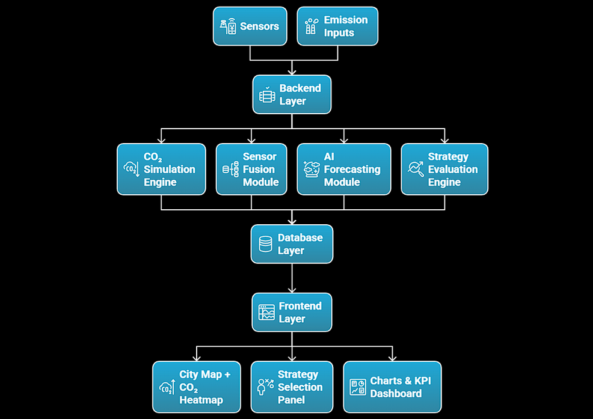

# V0-City-CO2 Digital Twin

A self-adaptive digital twin system for real-time monitoring, forecasting, and strategy evaluation of urban CO2 emissions.

## Quick Links
- Problem Statement
- System Architecture
- Core Capabilities

## Problem Statement
Urban environments generate high CO2 emissions from transport, power generation, and industrial activities. Existing solutions lack real-time monitoring, predictive intelligence, and the ability to digitally evaluate mitigation strategies before deployment. An adaptive, data-driven system is required for effective urban CO2 management.

## System Architecture
The system integrates sensor data, simulation models, AI forecasting, and strategy evaluation through a layered architecture.

### Architecture Layers
- Sensors and emission input sources
- Backend processing and orchestration
- CO2 simulation engine
- Sensor fusion module
- AI forecasting module
- Strategy evaluation engine
- Centralized database layer
- Frontend visualization layer

## Core Capabilities
- Real-time CO2 data ingestion and fusion
- Urban-scale CO2 simulation and heatmap generation
- AI-based short-term CO2 forecasting
- Digital evaluation of emission reduction strategies
- Decision-support dashboards with KPIs

## Technology Stack
- Frontend: React, Map visualization, Charting libraries
- Backend: API-based service layer
- AI: Time-series forecasting models
- Database: Relational data storage
- Communication: REST APIs and real-time updates
